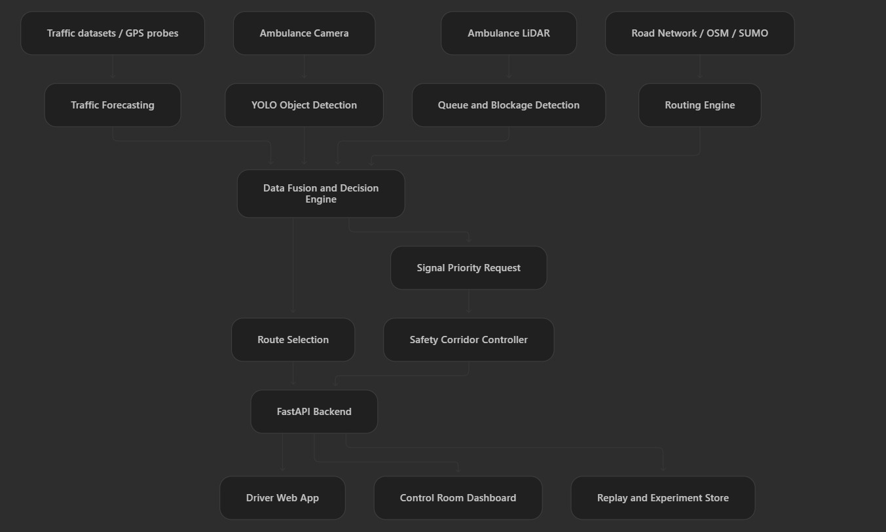

# ResQ

ResQ is a research prototype for ambulance routing and traffic-signal preemption.
Its Chennai routes are shortest paths on a checked-in, directed OpenStreetMap road
graph, priced by a trained Graph WaveNet speed forecaster when a corridor checkpoint
is built. The incident cue and signal states remain staged inputs, and the corridor
model is trained on SUMO simulation of the study area rather than measured Chennai
traffic — its accuracy is a statement about the simulator.

## Run locally

Prerequisites: Python 3.12 or 3.13 and Node.js. In this workspace, the existing
`.venv` can be used directly; `uv` does not need to be on `PATH`.

```powershell
cd C:\OblivionX\College\IDP
.\.venv\Scripts\python.exe -m uvicorn api.main:app --reload --host 127.0.0.1 --port 8000
```

In a second terminal:

```powershell
cd C:\OblivionX\College\IDP\web
npm install
npm run dev
```

Open <http://localhost:5173>. In **Live**, expand “Simulation controls” and
inject the staged incident; changing a control restarts that demo run. In
**Replay**, click Play to compare the regular ambulance and ResQ on the same
mapped road graph. The regular ambulance incurs an assumed 120-second incident
queue; ResQ takes a connected bypass after an assumed 8-second cue. The replay
shows its assumptions beside the map. Map tiles require internet, but the local
vector road overlay and routing data are checked in.

If `.venv` is missing, install `uv` and run `uv sync` from the project root, or
create a Python virtual environment and install the project with its dev extras.
Alternatively, `npm run build` produces a frontend served by FastAPI at
<http://localhost:8000>.

## Verify

```powershell
.\.venv\Scripts\python.exe -m pytest
.\.venv\Scripts\python.exe -m ruff check .
cd web
npm run build
```

## Generate synthetic experiment estimates

```powershell
.\.venv\Scripts\python.exe -m experiments.runner --seeds 20
```

The Results page also generates formula-based estimates and stores them in
`runs/resq_green.sqlite3`. These values must not be cited as measured performance.

## Run the real SUMO scenario

SUMO 1.27.1, TraCI, and `sumolib` are installed in this workspace's `.venv`.
No global `SUMO_HOME` or `PATH` change is required. To rebuild the current OSM
network and launch the ambulance run in SUMO-GUI:

```powershell
cd C:\OblivionX\College\IDP
.\scripts\sumo.ps1 -Build
```

For a fast headless verification:

```powershell
.\scripts\sumo.ps1 -Headless
```

Or call the components directly:

```powershell
.\.venv\Scripts\python.exe sim\chennai\build_network.py
.\.venv\Scripts\python.exe -m sim.chennai.run_sumo --gui --delay-ms 50
```

The generated scenario contains random background traffic and a TraCI-inserted
`AMB-01` emergency vehicle routed from the demo origin to the hospital. A local
smoke run reached the destination over 34 SUMO edges (2.44 km) in 197.6 simulated
seconds. This proves the simulator and TraCI loop run on this laptop; it is not a
validated performance result. The dashboard is not driven by a live SUMO vehicle
stream; it consumes SUMO indirectly, through the corridor speed histories that train
the forecaster described below.

For a fresh environment, install the simulation dependencies with
`pip install -e ".[sumo]"` or `uv sync --extra sumo`.

## Traffic forecasting

Three Graph WaveNet checkpoints back the forecasting stack. METR-LA and PEMS-BAY
validate the model class against the required persistence and historical-average
baselines on public sensor data. CHENNAI-SIM is the checkpoint the decision brain
uses: it is trained on repeatable SUMO runs of the study area, and the demonstration
replays its held-out split so the interface can show a live prediction next to the
truth it is judged against.

```powershell
.\scripts\forecast.ps1            # benchmarks and the corridor checkpoint
.\scripts\forecast.ps1 -Corridor  # just the Chennai corridor pipeline
```

Training uses `.venv-forecast` with the CUDA build of PyTorch; the API serves
inference from `.venv` on the CPU. Without a checkpoint the API stays up, the
Forecast page prints the two commands needed to build one, and routing falls back to
its previous staged travel times. Details and endpoints are in
[docs/TRAFFIC_FORECASTING_RUN.md](docs/TRAFFIC_FORECASTING_RUN.md); the model
selection analysis is in
[docs/TRAFFIC_FORECASTING_PLAN.md](docs/TRAFFIC_FORECASTING_PLAN.md).

## Architecture

The target system architecture combines traffic forecasting, ambulance camera
and LiDAR perception, routing, confidence-aware data fusion, signal priority,
and safety-constrained corridor control. The FastAPI backend exposes the
resulting decisions to the driver application, control-room dashboard, and
replay/experiment store.



The current review build implements the FastAPI backend, driver web app,
deterministic demonstration simulator, trained traffic forecasting, routing, fusion
primitives, and safety state-machine components. YOLO inference, live traffic feeds,
and full SUMO or CARLA decision-loop integration remain planned integration work.

```text
simulated corridor histories -> Graph WaveNet -> calibrated speed forecast
forecast -> macro observation -> fusion with camera detection -> route policy -> API -> React
SUMO/TraCI runner -> real background traffic + ambulance trip -> validation foundation
future web/SUMO bridge -> observations -> fusion -> route policy -> dashboard
```

The shared contract is in `schema/models.py`. The road extract was downloaded
from OpenStreetMap; map data is © OpenStreetMap contributors under ODbL 1.0.
The source and refresh time are recorded in `sim/chennai/roads.json`. To refresh
the extract, run `.\.venv\Scripts\python.exe scripts\build_road_graph.py`, then
rerun tests and visually review the paths. The demo router respects mapped
one-way streets but does not yet model turn restrictions, lane rules, or closures
beyond the staged incident section.

See `docs/IMPLEMENTATION.md` for the complete module map, API, adapter setup, and
research-integrity constraints. SUMO map generation instructions are under
`sim/chennai/README.md`.
